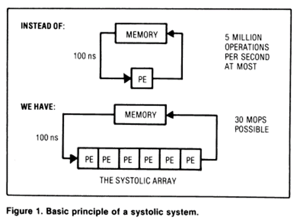
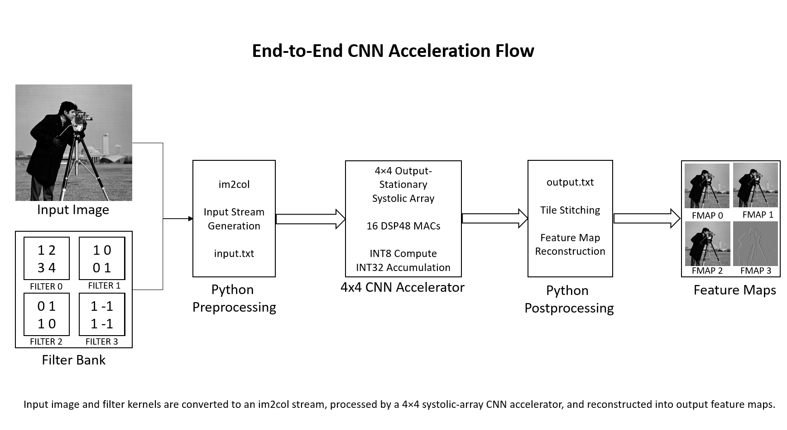
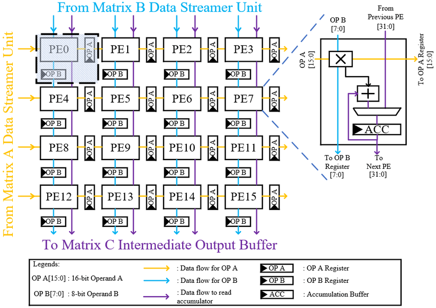
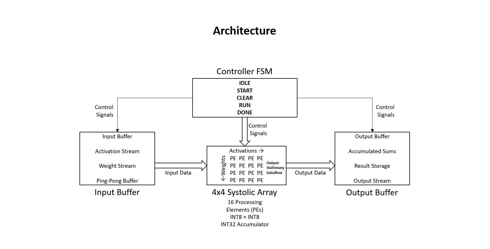
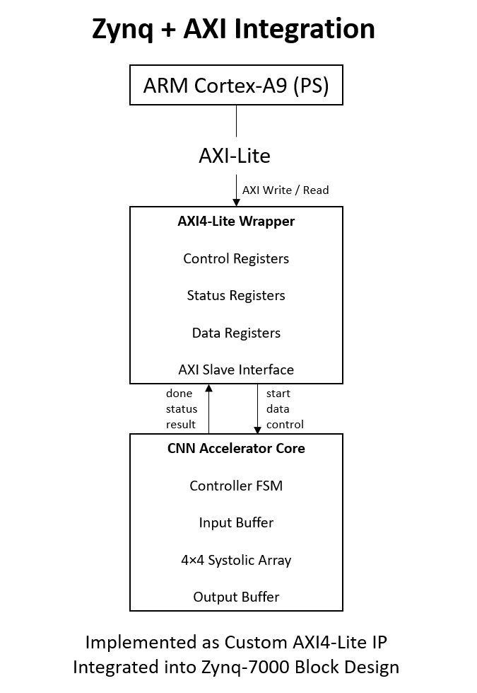
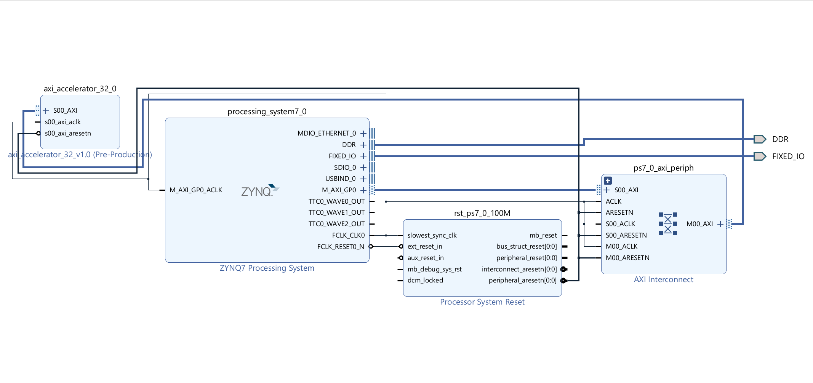
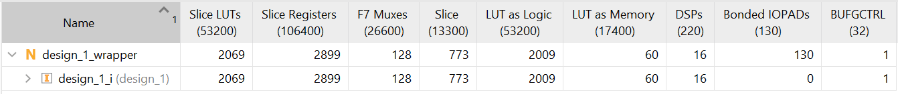
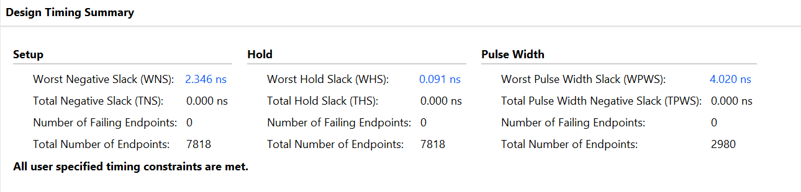
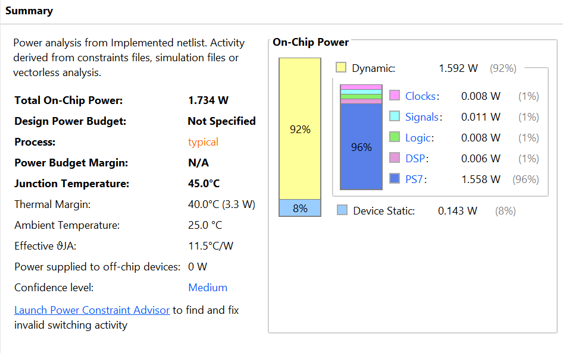

# Northern Lights AI Accelerator

Custom FPGA-based CNN Accelerator with a 4×4 Output-Stationary Systolic Array and AXI4-Lite Integration on Zynq-7000.

---

## Project Overview

Northern Lights is a custom hardware accelerator designed for convolutional neural network (CNN) workloads on FPGA platforms.

The accelerator implements a 4×4 Output-Stationary Systolic Array containing 16 Processing Elements (PEs) mapped onto FPGA DSP48 resources. The design supports INT8 computation with INT32 accumulation and is integrated into a Xilinx Zynq-7000 SoC through a custom AXI4-Lite interface.

A complete software-to-hardware inference flow was developed, including:

* Image preprocessing using im2col transformation
* Hardware-accelerated convolution
* Feature map reconstruction
* Zynq Processing System integration
* FPGA implementation and timing closure

---

## Key Features

* 4×4 Output-Stationary Systolic Array
* 16 Processing Elements (PEs)
* 16 DSP48 MAC Units
* INT8 × INT8 Computation
* INT32 Accumulation
* Custom AXI4-Lite Peripheral
* Zynq-7000 SoC Integration
* Python-Based CNN Pre/Post Processing
* FPGA Validated Implementation

---

## Why Systolic Arrays?

Traditional accelerator architectures repeatedly move data between memory and compute units, creating a memory bandwidth bottleneck.

Systolic arrays reduce memory traffic by allowing data to flow directly between neighboring processing elements, significantly improving throughput for matrix multiplication and convolution workloads.



*Figure adapted from classical systolic-array literature.(https://www.eecs.harvard.edu/~htk/publication/1982-kung-why-systolic-architecture.pdf)*

---

## End-to-End CNN Acceleration Flow

The complete inference pipeline begins with a grayscale image and a bank of convolution kernels.

Python preprocessing converts the image into an im2col representation and generates an input stream for the hardware accelerator. The accelerator performs convolution using a systolic array architecture, and Python postprocessing reconstructs the resulting feature maps.



---

## Output-Stationary Dataflow

The accelerator follows an Output-Stationary dataflow.

Partial sums remain inside each processing element while activations and weights stream through the array. This minimizes movement of accumulated results and improves compute efficiency.



*Source: [Original authors of the referenced GEMM accelerator architecture.](https://www.researchgate.net/figure/GEMM-core-internal-with-output-stationary-systolic-array-SA-consisting-four-column-and_fig4_366382440)*

---

## Accelerator Architecture

The accelerator consists of four primary hardware blocks:

* Controller FSM
* Input Buffer
* 4×4 Systolic Array
* Output Buffer

The Controller FSM manages execution using the following states:

```text
IDLE
START
CLEAR
RUN
DONE
```

The systolic array contains:

* 16 Processing Elements
* 16 DSP48 MAC Units
* INT8 × INT8 Multiply Operations
* INT32 Accumulation



---

## Zynq + AXI Integration

The accelerator was packaged as a custom AXI4-Lite IP and integrated into a Zynq-7000 Block Design.

The ARM Cortex-A9 Processing System communicates with the accelerator through memory-mapped AXI registers.

The AXI wrapper provides:

* Control Registers
* Status Registers
* Data Registers
* Start/Done Signaling



---

## FPGA Block Design

The complete system was integrated using Vivado IP Integrator.

The Processing System (PS) communicates with the custom accelerator IP through AXI4-Lite, enabling software-controlled accelerator execution.



---

## FPGA Implementation Results

### Resource Utilization

The accelerator achieves a compact implementation while utilizing dedicated DSP resources for computation.

| Resource  | Utilization |
| --------- | ----------- |
| LUTs      | 2069        |
| Registers | 2899        |
| DSP48s    | 16          |
| BRAM      | 0           |



---

### Timing Closure

The design successfully met timing constraints on the target Zynq-7000 FPGA.

| Metric                     | Value    |
| -------------------------- | -------- |
| Clock Frequency            | 100 MHz  |
| Worst Negative Slack (WNS) | 2.346 ns |
| Timing Status              | Met      |

Estimated maximum operating frequency:

**~127 MHz**



---

### Throughput

The accelerator produces one output tile every 13 clock cycles.

At 100 MHz:

**~0.49 GMAC/s**

Estimated peak throughput at maximum achievable frequency:

**~0.64 GMAC/s**

---

### Power Analysis

Post-implementation power analysis:

| Metric              | Value   |
| ------------------- | ------- |
| Total On-Chip Power | 1.734 W |



---

## Sample CNN Results

### Input Image


### Generated Feature Maps

| Feature Map 0                       | Feature Map 1                       |
| ----------------------------------- | ----------------------------------- |
|  |  |

| Feature Map 2                       | Feature Map 3                       |
| ----------------------------------- | ----------------------------------- |
|  |  |

The feature maps demonstrate successful convolution using four independent filters executed simultaneously on the systolic array.

---

## Repository Structure

```text
Northern-Lights-AI-Accelerator
│
├── rtl/
├── axi_integration/
├── verification/
├── software/
├── test_vectors/
├── output_feature_maps/
├── fpga_system/
├── docs/
└── results/
```

---

## RTL Modules

### PE.v

Processing Element implementing:

* INT8 multiplication
* INT32 accumulation
* Output-stationary accumulation

### Array_4x4.v

* 16 PE instances
* Systolic interconnect
* Tile-based matrix multiplication

### Controller.v

Finite State Machine controlling accelerator execution.

### Input_Buffer.v

Handles activation and weight streaming into the array.

### Output_Buffer.v

Stores accelerator outputs before software retrieval.

### Top_Accelerator.v

Top-level integration module.

---

## Software Pipeline

### Preprocessing

`cnn_im2col_input_generator.py`

Functions:

* Image loading
* im2col conversion
* Input stream generation

Produces:

```text
input.txt
```

### Postprocessing

`cnn_output_reconstructor.py`

Functions:

* Output parsing
* Tile stitching
* Feature map reconstruction

Produces:

```text
fmap_0.png
fmap_1.png
fmap_2.png
fmap_3.png
```

---

## Verification

Simulation was performed using:

```text
verification/tb_cnn.v
```

Verification includes:

* Input stream validation
* Tile computation verification
* Output reconstruction checks

---

## Future Work

* Parameterizable N×N Systolic Arrays
* DMA-Based Data Transfers
* AXI-Stream Interface
* Double-Buffered Dataflow
* Larger CNN Workloads
* Multi-Layer CNN Execution
* SystemVerilog/UVM Verification Environment

---

## Author

**Krithik Harshith**

B.E. Electrical and Electronics Engineering

BITS Pilani Goa Campus

2026 Graduate
